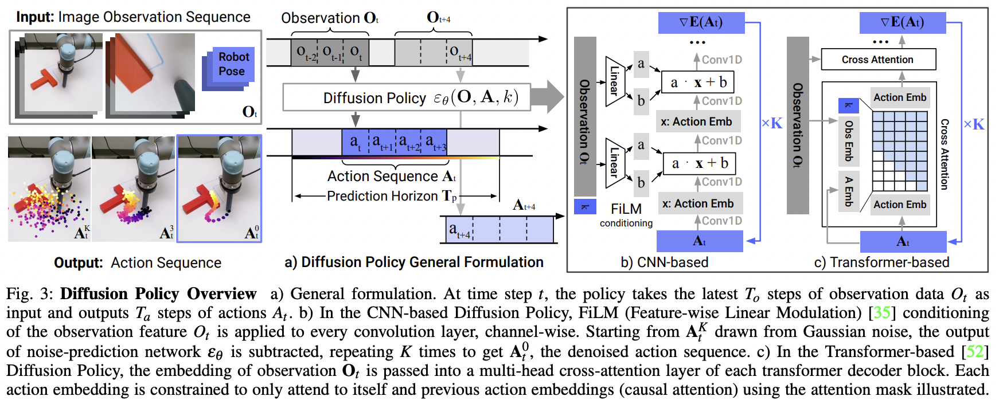

</img>

## Diffusion Policy (wip)

Implementation of <a href="https://arxiv.org/abs/2303.04137">Diffusion Policy</a>, Toyota Research's supposed <a href="https://www.tri.global/news/toyota-research-institute-unveils-breakthrough-teaching-robots-new-behaviors">breakthrough</a> in leveraging DDPMs for learning policies for real-world Robotics

What seemed to have happened is that a research group at Columbia adapted the popular SOTA text-to-image models (complete with denoising diffusion with cross attention conditioning) to policy generation (predicting robot actions conditioned on observations). Toyota research then validated this at a certain scale for imitation learning with real world robotic demonstrations. It is hard to know how much of a breakthrough this is given corporate press is prone to exaggerations, but let me try to get a clean implementation out, just in the case that it is.

The great thing is, if this really works, all the advances being made in text-to-image space can translate to robotics. Yes, this includes stuff like dreambooth and <a href="https://github.com/lucidrains/perfusion-pytorch">perfusion</a>.

Will also extend this to Q-functions as done in <a href="https://qtransformer.github.io/">this work</a>

## Citations

```bibtex
@article{Chi2023DiffusionPV,
    title   = {Diffusion Policy: Visuomotor Policy Learning via Action Diffusion},
    author  = {Cheng Chi and Siyuan Feng and Yilun Du and Zhenjia Xu and Eric A. Cousineau and Benjamin Burchfiel and Shuran Song},
    journal = {ArXiv},
    year    = {2023},
    volume  = {abs/2303.04137},
    url     = {https://api.semanticscholar.org/CorpusID:257378658}
}
```
